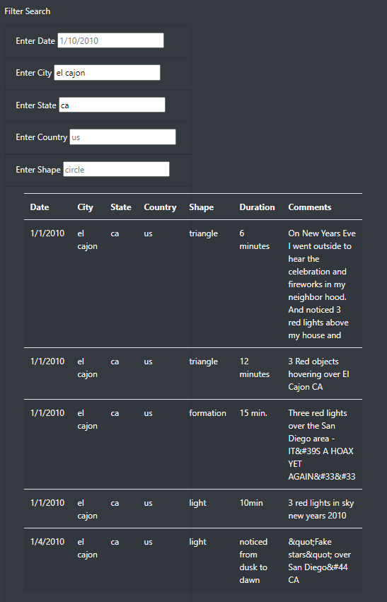
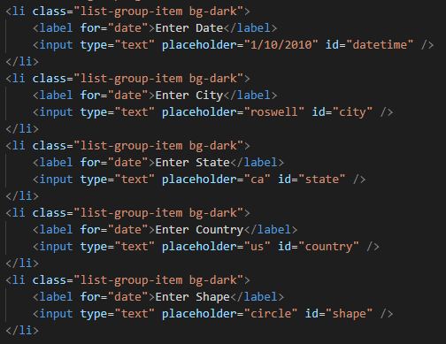
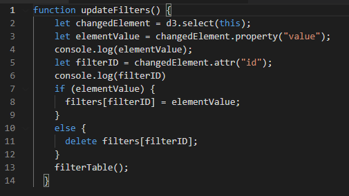
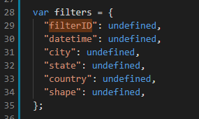
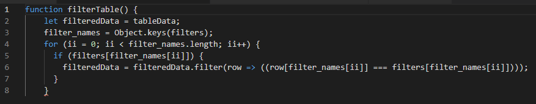
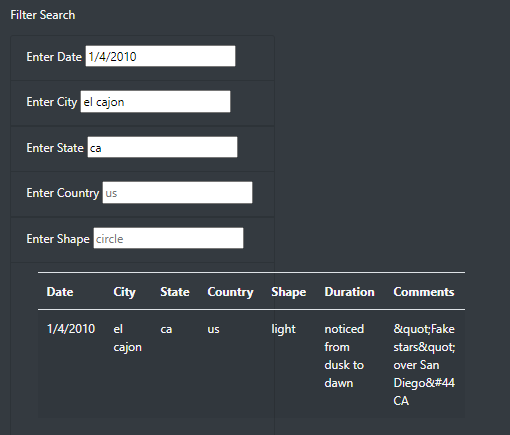
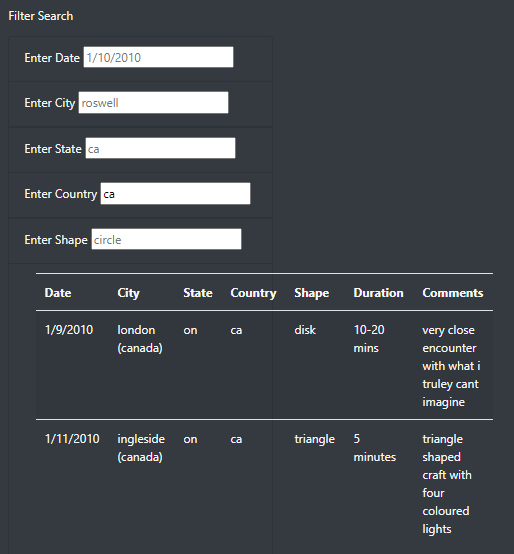
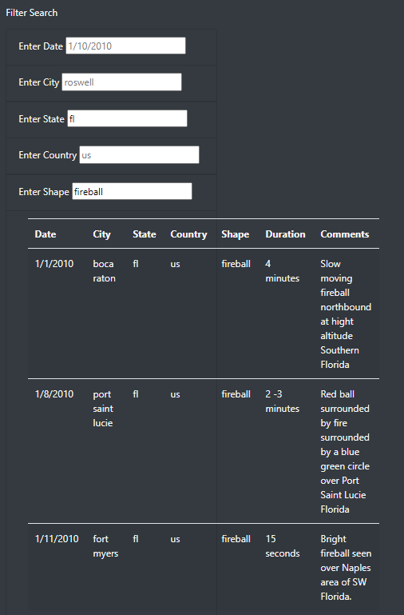

# UFOs

## Project Overview

Our goal in this project was to allow an in-depth analysis of UFO sightings by giving users filters for multiple criteria at the same time. In addition to the date, we added table filters for the city, state, country, and shape. The sample UFO sighting data was downloaded and stored as a JSON file 'static/js/data.js'.

Technologies Used:
- Javascript
- Bootstrap
- D3 (Data Driven Documents Javascript library)
- HTML / CSS

## Results

We used an HTML template 'index.html' that used Bootstrap components (e.g. Jumbotron, container-fluid, etc.) and the Bootstrap grid layout system. There were five input fields used for filter entries for 'Date', 'City', 'State', 'Country', and 'Shape' of UFO sighting (see the top portion of Figure 1 below).

**Figure 1 - Filter 'state==ca' (california) and 'city==el cajon'**



The HTML code that creates the input fields is shown in Listing 1 below. This code uses unique 'id' attributes on the 'input' elements. This id's allow us to determine which search parameters have been updated, so that we can filter the data.

**Listing 1 - the HTML input fields function**




The Javascript code that determines which search parameters have been updated is:

```
d3.selectAll("input").on("change", updateFilters);
```
The above line of code calls the updateFilters() function shown in Listing 2 below any time an input field changes. The updateFilters() function figures out which input fields were modified, and stores the appropriate values into the 'filters' dictionary object shown in Listing 3 below.

**Listing 2 - the updateFilters() function**



Once the updateFilters() function has figured out which filters to use, it calls filterTable(), shown in Listing 4 below.

**Listing 3 - the filters dictionary**



The filterTable() function (Listing 4 below) uses 'Object.keys(filters)' to get a list of keys in the filters dictionary (Listing 3 above). For each of those keys, it makes a new pass through the filteredData array and selects rows that match the query string entered into the given input field.

**Listing 4 - the filterTable() function**



Figure 2 below shows an example query using the 'Date', 'City', and 'State' input fields. Note that there is only one entry that matches the search. Figure 1 above is the same search without the 'Date' field specified (that search matched five rows instead of one row this time).

**Figure 2 - Filter 'state==ca' and 'city==el cajon' and 'date==1/4/2010'**



Figure 3 below shows a search with 'Country' set to 'ca' (canada). There were only two matches found in data.js, which was confirmed manually.

**Figure 3 - Filter 'country==ca' (canada)**



A final test was made for the 'Shape' field, as shown in Figure 4 below. The three matches were verified manually.

**Figure 4 - Filter 'state=fl' and 'shape=fireball'**



## Summary

The project was completed, and testing showed that it matches the requirements. The time estimate more closely matched the actual time required to complete the project.

#### One Drawback of this Project

The most difficult part of this project by far was getting the 'arrow function' to work properly. It's very difficult to debug code like that without a real symbolic debugger which can show actual values of variables and passes through loops. Because of this obstacle, I created another version of the code where a complete function was passed to the filter() method, instead of a cryptic arrow function. In this 'real' function, I could use 'console.log' statements to print out intermediate values as they appeared during the filtering process. Once that code was thoroughly debugged, I was able to strip down the 'real' function into an 'arrow' function.

#### Recommendations for Improvement

1. Our sample JSON file data.js was fairly small. So any updates of the table are fairly low-impact list updates to the browser. For larger datasets, the code should 'chunk' the results, and allow the user to jump directly to a given 'page' of results.

2. Linking this code to a geographical / map output format would have been much more interesting.
